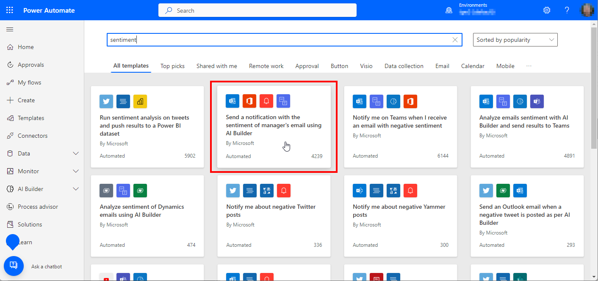
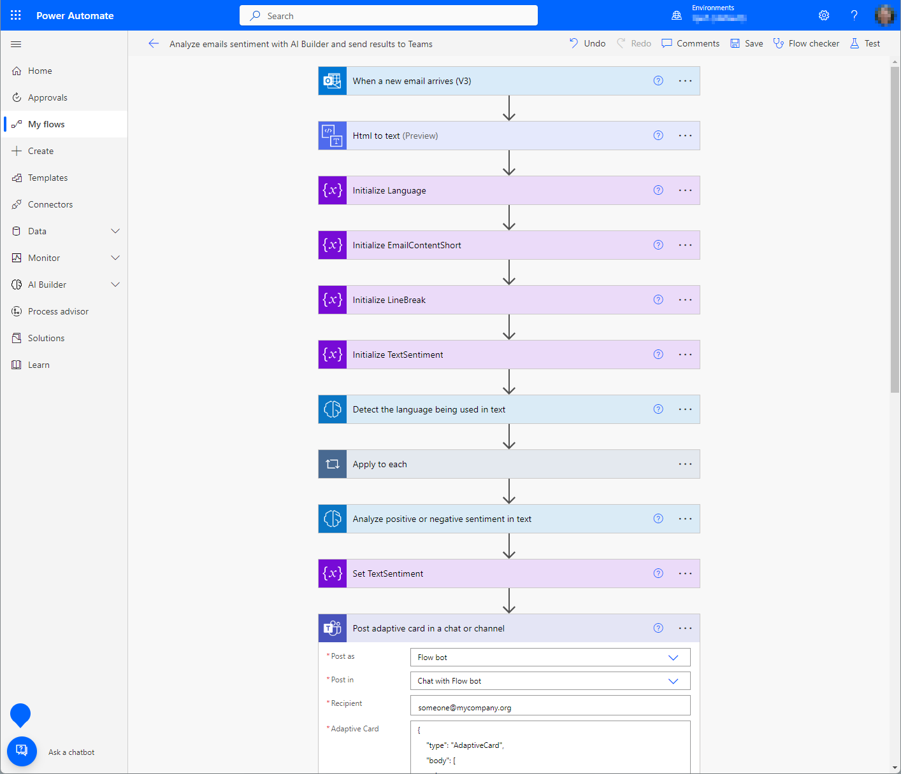
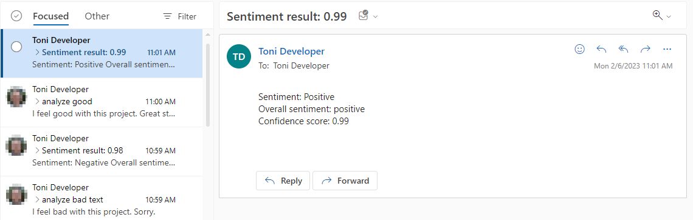
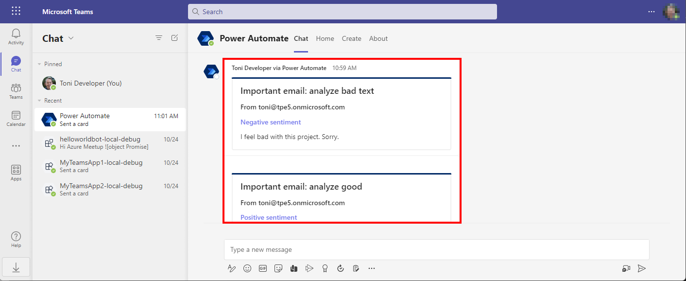

# 2-SampleFlowSentimentACtoTeams

Analyze emails sentiment with AI Builder and send the result to Teams in an Adaptive Card.

Create a new flow in Power Automate from a template "Send a notification with the sentiment of manager's email using AI Builder" that does the work.

Complete and adapt the flow if needed.

Send an email to the recipient. This triggers the flow.

Demo: Send an email in Outlook to a recipient, as here:  
~~~~
subject: analyze *  
I feel good with this project. Great stuff!  
~~~~

The result will create a notification in Teams, as here.

Adapt the flow and the Adaptive Card if needed.  
Happy testing!  
