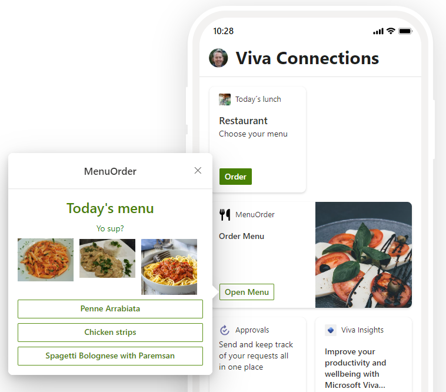
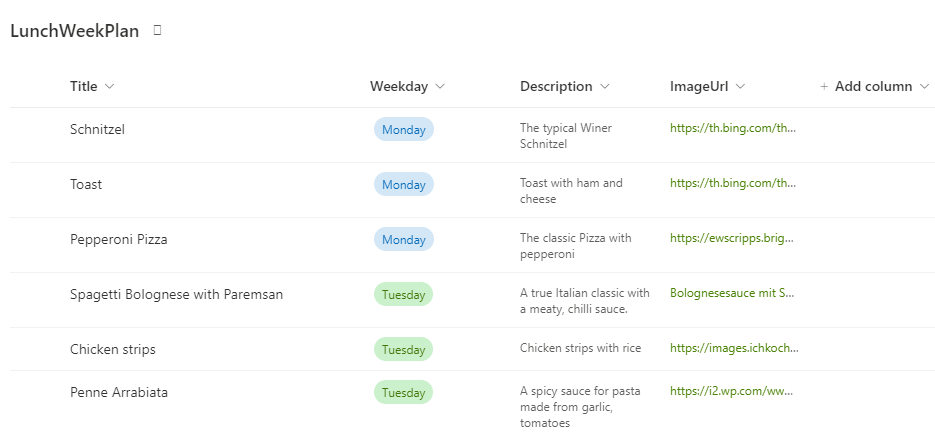
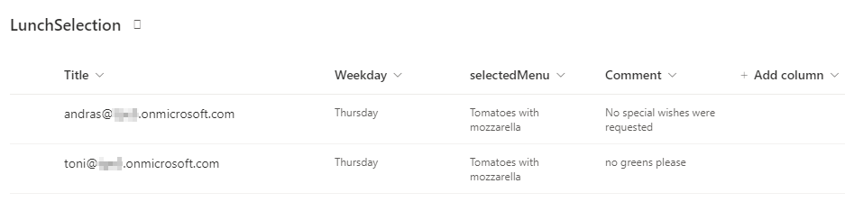

# Menu Order sample app

This is a sample app showing a simple Menu Order process in Viva Connections. The app was created with the yeoman generator as an ACE component.  
The logic for getting the lunch menu and for saving the selected menu per user is provided as Azure Logic Apps in the ./LogicApps directory. We are using SharePoint Online to store the data in custom lists.

## Prepare and run the sample

- Create a SPO site for the data or use an existing site
- In the SPO site, create a custom list named LunchWeekPlan and fill it with menu data - add Menus and Weekdays, as here

- In the SPO site, create a custom list named LunchSelection - the user´s menu selections will be stored here from the app

- Deploy the two Logic Apps into an Azure subscription
- Clone this repository
- Ensure that you are at the solution folder
- Modify your SPO site url in the ./config/serve.json file
- in the command-line run:
  - **npm install**
  - **gulp serve**
- Add the MenuOrder component to the workbench and try it out

## Resources

Read more about the requirements and SPFx apps here:

- [SharePoint Framework](https://aka.ms/spfx)
- [Microsoft 365 tenant](https://docs.microsoft.com/en-us/sharepoint/dev/spfx/set-up-your-developer-tenant)
- Get your own free development tenant by subscribing to [Microsoft 365 developer program](http://aka.ms/o365devprogram)
- [Getting started with SharePoint Framework](https://docs.microsoft.com/en-us/sharepoint/dev/spfx/set-up-your-developer-tenant)
- [Building for Microsoft teams](https://docs.microsoft.com/en-us/sharepoint/dev/spfx/build-for-teams-overview)
- [Use Microsoft Graph in your solution](https://docs.microsoft.com/en-us/sharepoint/dev/spfx/web-parts/get-started/using-microsoft-graph-apis)
- [Publish SharePoint Framework applications to the Marketplace](https://docs.microsoft.com/en-us/sharepoint/dev/spfx/publish-to-marketplace-overview)
- [Microsoft 365 Patterns and Practices](https://aka.ms/m365pnp) - Guidance, tooling, samples and open-source controls for your Microsoft 365 development

## Thanks

Thanks to my colleagues Andras Margittai and Marco Marthe for developing this Viva Connections sample app.

## Disclaimer

**THIS CODE IS PROVIDED _AS IS_ WITHOUT WARRANTY OF ANY KIND, EITHER EXPRESS OR IMPLIED, INCLUDING ANY IMPLIED WARRANTIES OF FITNESS FOR A PARTICULAR PURPOSE, MERCHANTABILITY, OR NON-INFRINGEMENT.**
